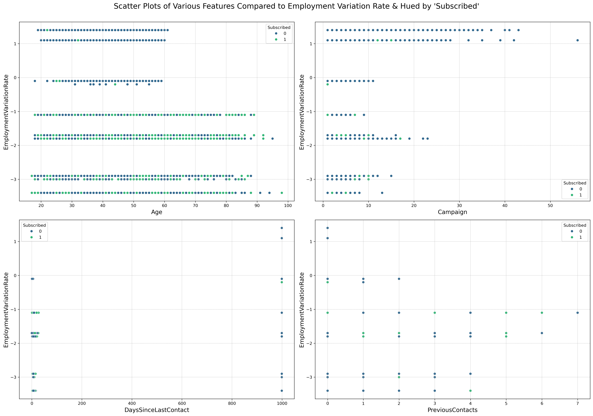

# Comparing Classifiers

## Overview

The purpose of this project is to evaluate the performance of various classifiers (Logistic Regression, KNN, Decision Tree, Random Forest, and SVM) on a dataset related to the marketing of bank products over the phone. The goal is to predict if a customer will subscribe to a term deposit.

## Dataset

The dataset used in this project is the [Bank Marketing Dataset](https://archive.ics.uci.edu/dataset/222/bank+marketing) from the [UCI Machine Learning Repository](https://archive.ics.uci.edu/). The dataset contains the following features:

- `Age`: The customer's age.
- `Job`: The customer's job.
- `MaritalStatus`: The marital staus of the customer.
- `Education`: The customer's education.
- `Default`: Does the customer have credit in default?
- `Housing`: Does the customer have a housing loan?
- `Loan`: Does the customer have a personal loan?
- `Contact`: How was the customer contacted (cellular or telephone)?
- `Month`: Last month of the year the customer was contacted.
- `DayOfWeek`: Last day of the week the customer was contacted.
- `Duration`: The duration of the last contact with the customer, in seconds.
- `Campaign`: Number of contacts performed during this campaign and for this client.
- `DaysSinceLastContact`: Number of days that passed by after the client was last contacted from a previous campaign.
- `PreviousContacts`: Number of contacts performed before this campaign and for this client.
- `OutcomeOfPreviousCampaign`: Outcome of the previous marketing campaign.
- `EmploymentVariationRate`: Employment Variation Rate - Quarterly Indicator
- `ConsumerPriceIndex`: Consumer Price Index - Quarterly Indicator
- `ConsumerConfidenceIndex`: Consumer Confidence Index - Quarterly Indicator
- `EuriborThreeMonthRate`: Euribor 3-Month Rate - Quarterly Indicator
- `NumberOfEmployees`: Number of Employees - Quarterly Indicator
- `Subscribed`: Has the client subscribed to a term deposit?

The target variable is `Subscribed`.

There are a total of 21 features (including the target variable) and 41,188 data points.

## Methods

The process for completing this project was broken down into several steps:

- **Step 1:** Understanding the Data
- **Step 2:** Read in the Data
- **Step 3:** Understanding the Features
- **Step 4:** Understanding the Task
- **Step 5:** Engineering Features
- **Step 6:** Train/Test Split
- **Step 7:** A Baseline Model
- **Step 8:** A Simple Model
- **Step 9:** Score the Model
- **Step 10:** Model Comparisons
- **Step 11:** Improving the Model

### Step 1: Understanding the Data

**Question:** "To gain a better understanding of the data, please read the information provided in the UCI link above, and examine the **Materials and Methods** section of the paper. How many marketing campaigns does this data represent?"

**Answer:** The "Materials and Methods" section details a dataset comprising 52,944 phone contacts from various marketing campaigns run by a Portuguese bank from May 2008 to June 2013. The paper's analysis is based on this combined data rather than on individual campaign numbers, which are not explicitly provided.

### Step 2: Read in the Data

The dataset was loaded.

#### Data Preparation and Feature Engineering

The initial data was transformed to improve its usability and prepare it for modeling. Key steps included:

Feature Renaming: Column names were changed for better readability and to be more descriptive.

Irrelevant Feature Removal: The Duration column was dropped because it is not a realistic predictor. The authors state that this feature is not known before a call is made, and its value of zero is a perfect predictor for a "no" outcome. It should only be used for benchmarking.

Data Summary: Basic statistics were calculated for all features to get a foundational understanding of the dataset.

Categorical Feature Processing:

Unique values within categorical columns were examined, cleaned, and transformed (e.g., converted to title case and unnecessary characters were removed).

Numerical Feature Processing:

Basic statistics (mean, median, min, max, standard deviation) were computed to understand the distribution of the data and identify potential outliers.

#### Data Quality Assessment

- The dataset was checked for missing values.
  - No missing values were found.
- The dataset was checked for duplicate rows.
  - 1,784 duplicate rows were found
  - Since this was a relatively small proportion of the dataset (~4.33% of rows), these duplicates were dropped to simplify modeling.
  - This left 39,404 rows in the dataset.
- The balance of the target variable (`Subscribed`) was examined to determine if the classes were imbalanced.
  - The classes were found to be imbalanced.
  - There were 34,806 / 39,404 instances (~88.33%) where `Subscribed`=='No'.
  - There were 4,598 / 39,404 instances (~11.67%) where `Subscribed`=='Yes'.

#### Data Visualization

Several visualization were created to help better understand the dataset and examine relationships between features. These can be seen below:

### Step 3: Understanding the Features

A summary of findings about the dataset was composed:

Size: The dataset initially had 41,188 entries, with duplicates being removed to yield a total of 41,176 entries and 21 columns.

Data Types: It contains a mix of numerical, categorical, and binary features, with no missing values.

Feature Types:

Numerical: Age, Duration, Campaign, DaysSinceLastContact, and various economic indicators.

Categorical: Job, MaritalStatus, Education, Default, Housing, Loan, Contact, Month, DayOfWeek, OutcomeOfPreviousCampaign, and Subscribed.

Data Preparation & Cleaning:

Categorical variables need to be encoded for modeling. Some, like Education, can be treated as ordinal, while others, like Job, will need one-hot encoding.

'Unknown' values should be handled as they appear in various columns.

Initial visualizations show potential outliers and varied distributions in numerical features, which may require normalization.

Target Variable: The Subscribed column is the binary target variable for the model.

Imbalance: The target variable is highly imbalanced, with 88.73% of entries being 'No' and 11.26% being 'Yes'. This imbalance must be addressed during modeling.

Cardinality: Features such as Job and Education have high cardinality, which will require careful handling during feature encoding.

### step 4: Understanding the Task

**Task:** "After examining the description and data, your goal now is to clearly state the Business Objective of the task. State the objective below."

**Response:** The business objective is to predict whether a client will subscribe to a term deposit using the features in the dataset. To make this prediction, various classification models will be trained and evaluated to determine the best performing model for this task.

### Step 5: Engineering Features

In this section, the features and target variable were transformed and encoded to prepare them for modeling.

- First, all categorical features were checked to determine the prevalence of 'Unknown' values.

| Features      | Number of 'Unknown' Values |
| ------------- | -------------------------- |
| Job           | 325                        |
| MaritalStatus | 79                         |
| Education     | 1686                       |
| Default       | 8266                       |
| Housing       | 980                        |
| Loan          | 980                        |

The raw dataset underwent significant cleaning and transformation to prepare it for effective modeling. Key steps included:

Handling the Default Feature: The Default column had a high number of 'Unknown' values and only three instances of 'Yes.' These three rows were removed as they were too few to provide meaningful predictive power. The remaining 'No' and 'Unknown' values were kept.

Imputing Unknown Values: For other columns with 'Unknown' values (Job, MaritalStatus, Education, Housing, and Loan), a Decision Tree Classifier was used to systematically impute the missing data. The model was trained on the known values of a given feature and then used to predict and fill in the 'Unknown' entries.

Feature Encoding:

Binary Encoding: Features with a binary outcome (Default, Housing, Loan, and Subscribed) were encoded as 0 for 'No' and 1 for either 'Yes' or 'Unknown'.

Label Encoding: Features with a natural order, such as Education, Month, and DayOfWeek, were converted to numerical labels.

One-Hot Encoding: The remaining categorical features were one-hot encoded to avoid introducing a false sense of order.

### Step 6: Train/Test Split

The data was split into a training set comprised of 80% of the available data points and a test set comprised of the remaining 20%.

### Step 7: A Baseline Model

The purpose of this section was to establish a baseline model for comparison with more complex models later in the analysis. The simplest baseline was chosen: a model that predicts the majority class (i.e., 'No') for all instances, also known as a Dummy Classifier. The performance of this model is reflected in the distribution of the target variable - the baseline accuracy is the proportion of the majority class, or 88.33%.

### Step 8: A Simple Model

Next, a simple model was created using Logistic Regression. This model will serve as a starting point for comparison with more complex models.

### Step 9: Score the Model

The results of this model's performance were as follows:

Training Time: 0.1337 seconds
Training Accuracy: 89.7335%
Test Accuracy: 89.4810%

### Step 10: Model Comparisons

Next, several models were built: KNN, Decision Tree, Random Forest, and SVM.

The same training and test sets were used for all models, and they were trained without any hyperparameter tuning. The results were as follows:

| Model Name          | Training Time (Seconds) | Training Accuracy (%) | Test Accuracy (%) |
| ------------------- | ----------------------- | --------------------- | ----------------- |
| Logistic Regression | 0.1305                  | 89.7335               | 89.4810           |
| KNN                 | 0.0081                  | 90.9803               | 88.6182           |
| Decision Tree       | 0.1275                  | 99.4924               | 83.0225           |
| Random Forest       | 2.0807                  | 99.4892               | 88.4786           |
| SVM                 | 29.6407                 | 89.6796               | 89.3288           |

### Step 11: Improving the Model

The best performing model was the Random Forest model, which had a training accuracy of 99.4892% and a test accuracy of 88.4786%.

The models were then trained once more with hyperparameter tuning to see if the performance could be improved. The hyperparameters tuned for each model were:

- Logistic Regression: `C`, `penalty`.
- KNN: `n_neighbors`, `weights`, and `metric`.
- Decision Tree: `criterion`, `max_depth`, `min_samples_split`, and `min_samples_leaf`.
- Random Forest: `n_estimators`, `max_depth`, `min_samples_split`, and `min_samples_leaf`.
- SVM: `kernel`, and `C`.

Results after tuning:

| Model Name          | Training Time (Seconds) | Training Score | Training Accuracy (%) | Test Score | Test Accuracy (%) | Precision | Recall   | F1 Score | ROC AUC  |
| ------------------- | ----------------------- | -------------- | --------------------- | ---------- | ----------------- | --------- | -------- | -------- | -------- |
| Logistic Regression | 3.4407                  | 0.896954       | 89.7557               | 0.895064   | 89.5064           | 0.613000  | 0.220000 | 0.323800 | 0.601000 |
| KNN                 | 15.1092                 | 0.893147       | 90.3966               | 0.889989   | 88.9989           | 0.535792  | 0.274444 | 0.362968 | 0.621895 |
| Decision Tree       | 33.5881                 | 0.896193       | 90.0222               | 0.897094   | 89.7094           | 0.610422  | 0.273333 | 0.377590 | 0.625422 |
| Random Forest       | 138.7228                | 0.898287       | 91.1612               | 0.895191   | 89.5191           | 0.605114  | 0.236667 | 0.340256 | 0.608378 |
| SVM                 | 26.0042                 | 0.894956       | 89.4956               | 0.889989   | 88.9989           | 0.552716  | 0.192222 | 0.285243 | 0.586084 |

Best parameters found:

| Model Name          | Hyperparameters                                                                     |
| ------------------- | ----------------------------------------------------------------------------------- |
| Logistic Regression | `C`: 0.1, `penalty`: 'l2'                                                           |
| KNN                 | `weights`: 'uniform', `n_neighbors`: 11, `metric`: 'manhattan'                      |
| Decision Tree       | `criterion`: 'gini', `max_depth`: 5, `min_samples_leaf`: 1, `min_samples_split`: 2  |
| Random Forest       | `n_estimators`: 200, `min_samples_split`: 2, `min_samples_leaf`: 2, `max_depth`: 10 |
| SVM                 | `C`: 0.1, `kernel`: 'rbf'                                                           |

#### Analysis of Results

- **Accuracy**: The Random Forest model showed the highest training accuracy (91.1612%) and the Decision Tree model showed the highest test accuracy (89.7094%).
- **Precision and Recall**: Decision Tree had a better balance of precision (0.6104) and recall (0.2733) compared to other models, which suggests it is good at identifying positive class without a high rate of false positives.
- **F1 Score and ROC AUC**: The Decision Tree model also had the highest F1 Score (0.3776) and ROC AUC (0.6254), indicating a good balance between precision and recall, and the ability to distinguish between the classes.

Best Model Performance: The Decision Tree model was the top performer, achieving the best balance across key metrics including accuracy, precision, recall, F1 score, and ROC AUC.

Performance on Unseen Data: It is the most reliable choice because it had a slightly higher test accuracy compared to the other models, which is a strong indicator of its ability to generalize to new, unseen data.

Training Time: While its training time was moderate, its superior overall performance makes it the best choice for this task.

#### Feature Importance

The feature importances of the Decision Tree model were examined to understand which features were most influential in predicting the target variable.

|                Feature                | Importance (%) |
| :-----------------------------------: | :------------: |
|           NumberOfEmployees           |     64.12      |
|         DaysSinceLastContact          |     13.85      |
|        ConsumerConfidenceIndex        |      5.96      |
|         EuriborThreeMonthRate         |      5.07      |
|                 Month                 |      2.82      |
|               DayOfWeek               |      2.57      |
|           Contact_Telephone           |      2.18      |
|          ConsumerPriceIndex           |      1.45      |
| OutcomeOfPreviousCampaign_Nonexistent |      1.09      |
|                  Age                  |      0.73      |
|               Campaign                |      0.09      |
|                Housing                |      0.08      |
|            Job_Unemployed             |      0.00      |
|              Job_Student              |      0.00      |
|            Job_Technician             |      0.00      |
|         MaritalStatus_Single          |      0.00      |
|         MaritalStatus_Married         |      0.00      |
|           Job_Self-Employed           |      0.00      |
|             Job_Services              |      0.00      |
|            Job_Blue-Collar            |      0.00      |
|              Job_Retired              |      0.00      |
|            Job_Management             |      0.00      |
|             Job_Housemaid             |      0.00      |
|           Job_Entrepreneur            |      0.00      |
|               Education               |      0.00      |
|        EmploymentVariationRate        |      0.00      |
|           PreviousContacts            |      0.00      |
|                 Loan                  |      0.00      |
|                Default                |      0.00      |
|   OutcomeOfPreviousCampaign_Success   |      0.00      |

The Decision Tree model had the best overall performance in the analysis, demonstrating a strong balance across all key metrics. Its superior test accuracy indicates a robust ability to generalize to unseen data. This strong performance can largely be attributed to a few key features: NumberOfEmployees, DaysSinceLastContact, ConsumerConfidenceIndex, and EuriborThreeMonthRate. These four features were found to be the most influential predictors, collectively accounting for 89% of the total feature importance in the model's predictions. The remaining 11% of predictive power was distributed among the other features.

In the Decision Tree model, the majority of features had an importance score of 0%. This indicates that the model did not use these features to make its predictions. The model focused its predictive power on a small number of features that provided the most significant information for splitting the data.

This is a common behavior for decision trees, which are designed to identify and rely on the most dominant features to classify data effectively. In this case, NumberOfEmployees and DaysSinceLastContact were particularly influential, accounting for nearly 78% of the total importance.

The model's reliance on a few key features is also supported by its relatively shallow maximum depth of 5, which limits the number of features it can use and forces it to prioritize the most informative ones for its splits.

## Conclusion

This project's objective was to predict customer subscription to term deposits using a comprehensive dataset from a Portuguese bank's telemarketing campaigns. To achieve this, a range of classification models—including Logistic Regression, KNN, Decision Tree, Random Forest, and SVM—were trained and evaluated. The final goal was to identify the model with the best predictive accuracy and operational efficiency.

### Key Findings

- **Data Understanding and Preparation:** Through thorough data exploration and cleaning, important insights were extracted. For example, the `Duration` feature was dropped due to its leakage into the target outcome, and categorical features with high counts of 'Unknown' values were handled either by removal or imputation.

- **Model Building and Evaluation:** The initial baseline model using a Dummy Classifier provided a foundational accuracy of 88.33%. Further, multiple models were evaluated with Logistic Regression serving as a simple model reference. It was found that while models like the Random Forest and SVM had higher computational costs, their performance didn't substantially surpass the simpler Logistic Regression in terms of test accuracy.

- **Hyperparameter Tuning:** Through systematic tuning of model parameters, improvements in accuracy, precision, recall, and F1-score were observed. Decision Tree emerged as the model with the best balance of predictive performance and computational efficiency, achieving the highest test accuracy and F1-score among all models post-tuning.

- **Feature Importance:** Analysis of feature importances in the best-performing Decision Tree model highlighted that a few features, particularly `NumberOfEmployees` and `DaysSinceLastContact`, played significant roles in predictions, demonstrating the importance of the bank's internal dynamics and follow-up strategies on customer conversion rates.

### Business Implications

Based on the Decision Tree model's insights, the bank can strategically enhance its marketing campaigns. By leveraging the model's high-importance features, the bank can:

Optimize Follow-Up Efforts: The significant importance of DaysSinceLastContact suggests that the timing of calls is a key factor. The bank can use this information to prioritize follow-up calls to increase the chances of a successful subscription.

Tailor Customer Interactions: Understanding that internal and economic factors, such as NumberOfEmployees and ConsumerConfidenceIndex, are strong predictors allows the bank to tailor its approach. Sales representatives can adjust their strategy based on these high-impact variables to improve their interactions and outcomes with potential clients.

### Recommendations for the Future

- **Deeper Analysis of Underperforming Features:** A more granular analysis could unravel why many features ended up having zero importance in the Decision Tree model and whether these features could be engineered differently to extract more predictive power.

- **Addressing Class Imbalance:** Techniques to handle class imbalance could improve model sensitivity towards the minority class, which is critical in marketing strategies aimed at increasing customer conversion rates.

- **Extended Feature Engineering:** More complex transformations and interactions between features could be explored to uncover hidden relationships that could improve model performance.

- **Longitudinal Analysis:** Considering the dataset spans multiple years, a temporal analysis to understand how customer behavior and economic conditions change over time could enhance the model's robustness and relevance to current scenarios.
